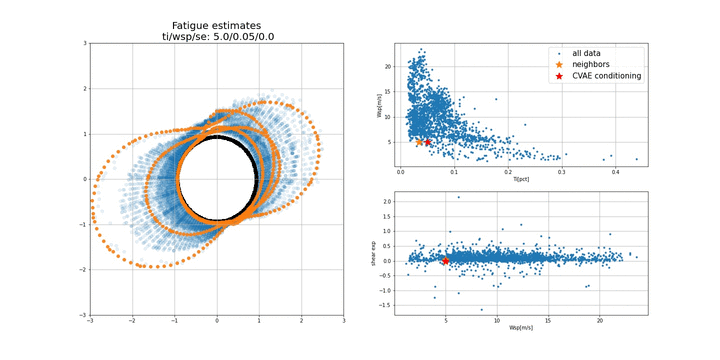

## Conditional Variational Autoencoder for Wind Turbine Blade Fatigue
This code applied a simple Conditional Variational Autoencoder (CVAE) with feed-forward layers on the problem of estimation of 
fatigue from coarse (10-minute) Supervisory Control and Data Acquisition (SCADA) system data. 

In the following animation the effect of changing the conditioning variables on the estimated cross-section fatigue values is shown.

For more information on the simulation data please refer to [our paper](https://onlinelibrary.wiley.com/doi/full/10.1002/we.2621).

## Dataset and Pre/post processing code.
The dataset is fatigue computations for 1999 different wind conditions, performed with [OpenFAST](https://github.com/OpenFAST) and [BECAS](https://becas.dtu.dk/). 

## Dependencies
The dependencies are `tensorflow` (tested with version 2.4.0) and `tensorflow_probability`(tested with version 0.12.1).

## Demo Colab
You can run the code in a google colab notebook:

                                                                             
